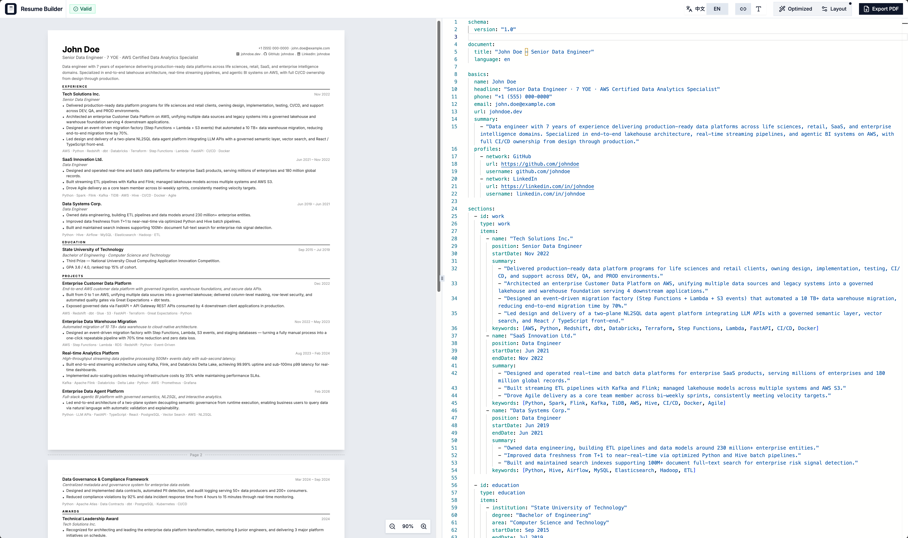
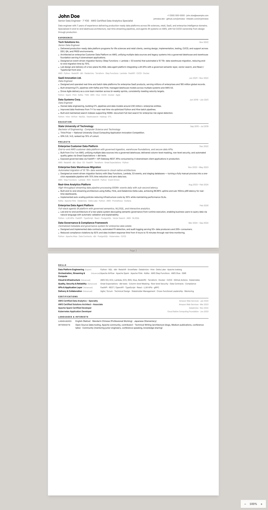

# Resume as Code

This project implements a "Resume as Code" philosophy, leveraging LLMs (Large Language Models) and structured data to automate the creation of highly tailored, professional resumes.

It solves the common pain points of resume maintenance:

- **Fragmentation**: Keeping multiple versions of Word/PDF files for different job applications.
- **Inconsistency**: Difficulty in maintaining consistent formatting and content across versions.
- **Time-Consuming**: Manually tailoring resumes for each Job Description (JD) is tedious.

By maintaining a single "Master Timeline" of your career and using AI agents to dynamically assemble resumes, you can generate a perfect match for any job opportunity in minutes.





[View Full Resume PDF (EN)](assets/resume.pdf)

[查看完整中文版简历 PDF (ZH)](assets/resume_zh.pdf)

## ✨ Core Features

- **Single Source of Truth**: All career data (work, projects, education, certificates) is stored in modular YAML files.
- **Resume Builder App**: A local-first workbench with live YAML editor, real-time preview, deterministic pagination, and one-click PDF export.
- **AI-Powered Agents**:
  - **Resume Generation Agent**: Analyzes JDs and assembles targeted resumes.
  - **Timeline Polishing Agent**: Polishes raw experience descriptions using STAR/3W methodologies.
  - **Interview Preparation Agent**: Generates comprehensive interview guides based on your resume and target JD.
- **Dual YAML Format Support**: Supports both the legacy [YAMLResume](https://yamlresume.dev/docs) format and a new richer custom schema (v1.0), with automatic detection and seamless compatibility.
- **Automated Validation**: Integrated validation ensures generated resumes are syntactically correct and ready for rendering.
- **Multi-Format Export**: Supports exporting to high-fidelity PDF via the built-in Puppeteer export service, plus HTML and Markdown via the YAMLResume compiler.
- **Multi-Language Support**: Supports English, Simplified Chinese, Traditional Chinese (HK/TW), Spanish, French, and Norwegian, with a one-click language toggle in the builder.

---

## 🖥️ Resume Builder App

The `resume-builder-app/` directory contains a local-first resume workbench built with React, Vite, Monaco Editor, and Puppeteer.

### Features

| Feature                      | Description                                                                    |
| ---------------------------- | ------------------------------------------------------------------------------ |
| **Split Editor + Preview**   | Monaco YAML editor on the left, pixel-perfect A4 preview on the right          |
| **Live Validation**          | Real-time YAML syntax and schema validation with inline diagnostics            |
| **Deterministic Pagination** | Fine-grained block-level pagination with proper keep-together logic            |
| **Optimize Layout**          | One-click spacing optimization with adjustable scale (0.7×–1.3×)               |
| **PDF Export**               | Local Puppeteer + headless Chromium service for high-fidelity PDF generation   |
| **Language Toggle**          | Switch between 中文 and English rendering with one click                       |
| **Preview Zoom**             | Floating zoom control (scale only — does not affect rendering/export)          |
| **Dual Format Support**      | Auto-detects legacy yamlresume or new schema v1.0 YAML                         |
| **Section Ordering**         | Respects `layouts[].sections.order` (legacy) or top-level `order` (new schema) |

### Quick Start

```bash
cd resume-builder-app

# Install dependencies (also installs Chrome for Puppeteer)
pnpm install

# Start dev server (web preview + PDF export service)
pnpm dev
# → Web UI: http://localhost:5173
# → PDF Export Service: http://localhost:3001

# Production build
pnpm build
pnpm start
```

### Architecture

```
resume-builder-app/
├── src/
│   ├── app/
│   │   ├── App.tsx              # Workspace shell (editor + preview + toolbar)
│   │   ├── renderer/
│   │   │   ├── ResumeRenderer.tsx    # Converts RenderModel → fine-grained blocks
│   │   │   ├── PaginatedPaper.tsx    # Measures blocks → A4 page containers
│   │   │   └── PrintStyles.tsx       # Print/PDF CSS overrides
│   │   └── routes/
│   │       └── PrintRoute.tsx        # Headless print route for PDF export
│   ├── compiler/
│   │   ├── compile-legacy.ts         # yamlresume → RenderModel adapter
│   │   └── compile-new-schema.ts     # New schema v1.0 → RenderModel compiler
│   ├── schema/
│   │   └── resume-schema.ts          # TypeScript types for new YAML schema v1.0
│   ├── models/
│   │   └── index.ts                  # Normalized RenderModel (single renderer input)
│   └── export-service/
│       └── server.ts                 # Express + Puppeteer PDF export service
├── package.json
└── vite.config.ts
```

---

## 📋 YAML Resume Formats

The Resume Builder supports two YAML formats. Files are auto-detected at load time.

### New Schema (v1.0) — Recommended

The new format is a richer, versioned schema owned by the builder app. It supports discriminated section types, stable IDs, visibility flags, layout hints, and flexible content structures.

```yaml
schema:
  version: '1.0'
  generator: resume-builder-app

document:
  title: 'My Resume'
  language: en # en | zh-hans | zh-hant-hk | zh-hant-tw | es | fr | no

basics:
  name: Zhang Wei
  headline: 'Senior Data Engineer · 7 YOE'
  phone: '+86 138 8888 8888'
  email: zhangwei@outlook.com
  url: zhangwei.dev
  summary:
    - 'Bullet point one describing core competency.'
    - 'Bullet point two with specific achievements.'
  profiles:
    - network: GitHub
      url: https://github.com/zhangwei
      username: github.com/zhangwei

# profiles can also be placed here (sibling of basics) for yamlresume compatibility
# profiles:
#   - network: GitHub
#     url: https://github.com/zhangwei
#     username: github.com/zhangwei

sections:
  - id: work
    type: work
    title: 'Work Experience'
    items:
      - id: job-1
        name: Acme Corp
        position: Senior Engineer
        startDate: '2022-01'
        endDate: '2024-06'
        summary:
          - 'Led migration of data platform to lakehouse architecture.'
          - 'Reduced pipeline latency by 60% through stream processing.'
        keywords: [Spark, Kafka, AWS, Terraform]

  - id: education
    type: education
    title: 'Education'
    items:
      - institution: MIT
        degree: Master
        area: Computer Science
        startDate: '2018-09'
        endDate: '2020-06'

  - id: projects
    type: projects
    title: 'Projects'
    items:
      - id: proj-1
        name: Data Platform v2
        description: 'Enterprise-scale lakehouse platform'
        startDate: '2023-03'
        endDate: '2024-01'
        summary:
          - 'Designed and implemented end-to-end lakehouse on AWS.'
        keywords: [Databricks, Delta Lake, Airflow]

  - id: skills
    type: skills
    title: 'Skills'
    items:
      - name: Languages
        keywords: [Python, SQL, TypeScript, Go]
      - name: Data
        keywords: [Spark, Kafka, Airflow, dbt]

  - id: certificates
    type: certificates
    title: 'Certificates'
    items:
      - name: AWS Certified Data Analytics
        issuer: Amazon Web Services
        date: '2023-05'

  - id: langAndInterests
    type: langAndInterests
    title: 'Languages & Interests'
    languages:
      - language: English
        fluency: Professional Working
      - language: Mandarin Chinese
        fluency: Native
    interests:
      - name: Open Source
        keywords: [data tooling, contributor]

# Optional: explicit section display order
order:
  - work
  - education
  - projects
  - skills
  - certificates
  - langAndInterests

layout:
  template: jake
  page:
    margins: { top: 1.5cm, left: 1.5cm, right: 1.5cm, bottom: 1.5cm }
    showPageNumbers: true
  typography:
    fontSize: 11pt

themeOverrides:
  spacing:
    sectionGap: 12
    entryGap: 8
```

### Legacy Format (YAMLResume)

The [YAMLResume](https://yamlresume.dev/docs) format uses a flat `content` object with fixed section keys. The builder auto-detects this format by the presence of `content` at the root.

```yaml
locale:
  language: zh-hans

layouts:
  - engine: latex
    sections:
      aliases:
        basics: 基本信息
        work: 工作经历
        education: 教育经历
        projects: 项目经历
        skills: 专业技能
        certificates: 证书
      order:
        - basics
        - education
        - work
        - projects
        - skills
        - certificates
    page:
      margins: { top: 1.5cm, left: 1.5cm, right: 1.5cm, bottom: 1.5cm }
      showPageNumbers: true
    template: jake
    typography:
      fontSize: 11pt

content:
  basics:
    name: John Doe
    phone: '+1 555-123-4567'
    email: john.doe@example.com
    url: https://johndoe.dev
    summary: |
      - 7 years of data engineering experience with Python and SQL.
      - Experienced in ETL automation, data quality, and monitoring.
  profiles:
    - network: GitHub
      url: https://github.com/johndoe
      username: johndoe
  education:
    - institution: Example University
      degree: Bachelor
      area: Computer Science
      startDate: Sep 1, 2015
      endDate: Jul 1, 2019
  work:
    - name: Acme Inc
      position: Senior Engineer
      startDate: Nov 14, 2022
      endDate: Now
      summary: |
        - Built enterprise data platform from scratch.
      keywords: [Python, React, AWS]
  projects:
    - name: Data Platform
      description: Enterprise lakehouse
      startDate: Mar 1, 2023
      endDate: Jan 1, 2024
      summary: |
        - End-to-end lakehouse on AWS.
      keywords: [Databricks, Airflow]
  skills:
    - name: Languages
      keywords: [Python, SQL, TypeScript]
  certificates:
    - name: AWS Certified
      issuer: AWS
      date: May 2023
```

### Format Differences

| Feature            | Legacy (YAMLResume)                    | New Schema (v1.0)                     |
| ------------------ | -------------------------------------- | ------------------------------------- |
| Root structure     | `content` object with fixed keys       | `basics` + `sections` array           |
| Section definition | Fixed keys (`work`, `education`, etc.) | Discriminated union with `type` field |
| Section ordering   | `layouts[].sections.order`             | Top-level `order` array               |
| Section titles     | `layouts[].sections.aliases`           | Per-section `title` field             |
| Item IDs           | Not supported                          | Optional `id` on each item            |
| Visibility control | Not supported                          | `visible` flag per section/item       |
| Summary format     | Multiline pipe-string (`\|`)           | Array of strings or pipe-string       |
| Profiles location  | `content.profiles` (sibling of basics) | `basics.profiles` or root `profiles`  |
| Language setting   | `locale.language`                      | `document.language`                   |
| Layout config      | `layouts[]` array (multi-engine)       | Single `layout` object                |
| Theme overrides    | Not supported                          | `themeOverrides` (colors, spacing)    |
| Schema versioning  | Not supported                          | `schema.version` field                |

---

## 🏗️ Architecture & Workflow

The system operates through three primary AI agents:

### 1. Timeline Polishing Agent

_Input: Raw text description of a job or project._
_Output: Structured, polished YAML file in `data/timeline/`._

1.  **Input Analysis**: Identifies if the input is Work Experience or a Project.
2.  **Polishing**: Applies **STAR** (Situation, Task, Action, Result) for work or **3W** (What, Why, How) for projects.
3.  **Enrichment**: Infers relevant technical keywords and industry context.
4.  **Storage**: Saves the polished artifact to the timeline library.

### 2. Resume Generation Agent

_Input: Target Job Description (JD)._
_Output: A complete, tailored resume YAML file in `data/resumes/`._

1.  **Company & Business Analysis**: Researches the company's business lines, strategic direction, tech stack, and infers which business unit the role supports. Uses DeepWiki, Context7, and Web Search.
2.  **Job Analysis**: Deep-analyzes the JD in the context of the company's business — infers what the company _actually needs_, corrects HR's generic boilerplate, and produces a rewritten JD sharper than the original.
3.  **Matching**: Selects the most relevant experiences from the Timeline library based on the analysis.
4.  **Section Generation**: Generates tailored Summary, Skills, Work, and Project sections.
5.  **Assembly**: Combines all sections with static profile data (Education, Certificates) into a final YAML file.
6.  **De-AI Pass**: Runs a language-aware humanizer over all free-text fields to strip AI writing patterns, making the resume read as human-written. English and Romance languages use [blader/humanizer](https://github.com/blader/humanizer); Chinese uses [op7418/humanizer-zh](https://github.com/op7418/humanizer-zh).
7.  **Quality Review & Revision** (optional, multi-round): Reviews the resume against a structured audit framework ([itMrBoy/resumePolice](https://github.com/itMrBoy/resumePolice)) covering first impression, deep audit, impact narrative, and JD alignment. Produces a YAML analysis artifact, then optionally revises the resume based on findings. Supports 1-3 review-revise-humanize cycles.
8.  **Validation** (optional): Validates the output against the yamlresume schema if compatibility mode is enabled.

### 3. Interview Preparation Agent

_Input: Resume, JD Analysis, Company Business Analysis._
_Output: A comprehensive Interview Preparation Guide in `data/interviews/`._

1.  **Input Verification**: Ensures all necessary context files are present.
2.  **Strategy Generation**: Creates a personal introduction strategy tailored to the role.
3.  **Deep Dive**: Generates STAR-based deep dive questions for every project.
4.  **Q&A Bank**: Creates an extensive technical Q&A bank covering specific tech, architecture, and domain knowledge.
5.  **Behavioral & Reverse**: Prepares behavioral questions and high-quality reverse interview questions.

## 📂 Directory Structure

```text
.
├── AGENTS.md            # Universal entry point for any AGENTS.md-aware agent
├── skills/              # Three portable Agent Skills (the workflow source of truth)
│   ├── resume-generation/        # JD → tailored YAML resume
│   ├── timeline-polishing/       # Raw notes → STAR/3W YAML timeline
│   ├── interview-preparation/    # Resume + JD + Company → Markdown interview guide
│   ├── .claude-plugin/plugin.json  # Claude Code plugin manifest
│   └── README.md
├── .claude-plugin/marketplace.json  # Claude Code plugin marketplace registration
├── scripts/install-skills.mjs       # One-command installer for any supported agent
├── resume-builder-app/  # Local-first resume workbench
└── data/                # All user-owned content lives here
    ├── profiles/        #   Candidate's static data (basics, education, certificates)
    ├── timeline/        #   Master timeline library (polished work + project YAML)
    ├── drafts/          #   Raw notes waiting to be polished into the timeline
    ├── resumes/         #   Final tailored resume files
    ├── interviews/      #   Generated interview guides
    └── .cache/          #   Per-run intermediate artifacts (gitignored)
```

## 🤖 AI Tools Support & Configuration

The resume-as-code workflow is packaged as three portable [Agent Skills](https://agentskills.io) under [`skills/`](skills/). They work with every major coding agent — install with **one command**.

### One-command install

From the repo root:

```bash
pnpm skills:install <agent>   # one specific agent
pnpm skills:install all       # everything supported
pnpm skills:install <agent> --dry-run   # preview without writing
pnpm skills:uninstall <agent>|all       # clean removal
```

| Agent                                                                         | Install command                                                                                                     | Notes                                                                    |
| ----------------------------------------------------------------------------- | ------------------------------------------------------------------------------------------------------------------- | ------------------------------------------------------------------------ |
| **Claude Code** (marketplace)                                                 | `/plugin marketplace add zhiweio/resume-as-code` then `/plugin install resume-as-code-skills@resume-as-code-skills` | Native UX, no clone needed beyond marketplace                            |
| **Claude Code** (local)                                                       | `pnpm skills:install claude`                                                                                        | Symlinks each skill into `.claude/skills/` for live-reload               |
| **GitHub Copilot**                                                            | Zero-config (committed)                                                                                             | Adapter file `.github/copilot-instructions.md` is committed in this repo |
| **Codex** / **OpenCode** / **Aider** / **Qoder** / **Continue** / **RooCode** | Zero-config                                                                                                         | Read `AGENTS.md` natively                                                |
| **Cursor** (recent)                                                           | Zero-config (via `AGENTS.md`) — or `pnpm skills:install cursor` for an explicit `.cursor/rules/` file               | —                                                                        |
| **Trae**                                                                      | Zero-config (committed)                                                                                             | Adapter `.trae/rules/project_rules.md` is committed in this repo         |
| **Windsurf**                                                                  | `pnpm skills:install windsurf`                                                                                      | Writes `.windsurf/rules/resume-as-code.md`                               |
| **Cline** / **RooCode**                                                       | `pnpm skills:install cline`                                                                                         | Writes `.clinerules`                                                     |

### The three skills

| Skill                                                            | Trigger                                               | Output                                         |
| ---------------------------------------------------------------- | ----------------------------------------------------- | ---------------------------------------------- |
| [`resume-generation`](skills/resume-generation/SKILL.md)         | User provides a Job Description                       | Tailored YAML resume in `data/resumes/`        |
| [`timeline-polishing`](skills/timeline-polishing/SKILL.md)       | User provides raw work or project notes               | Structured YAML timeline in `data/timeline/`   |
| [`interview-preparation`](skills/interview-preparation/SKILL.md) | User provides Resume + JD Analysis + Company Analysis | Markdown interview guide in `data/interviews/` |

### Adding a new agent

1. Open [`scripts/install-skills.mjs`](scripts/install-skills.mjs).
2. Add a new entry to the `AGENTS` map describing where the agent expects its rules file.
3. Verify with `pnpm skills:install <new-agent> --dry-run`.

## 🚀 Usage Guide

### Prerequisites

- **Node.js** (v18+) & **pnpm** installed.
- An LLM interface (e.g., GitHub Copilot Chat in VS Code).

### Step 1: Build Your Timeline Library

Don't write a resume yet. First, build your database of experiences.

1.  Open Copilot Chat.
2.  Paste a raw description of a past job or project.
3.  The **Timeline Polishing Agent** will format it into a structured YAML file in `data/timeline/`.
4.  Review and save the file.

### Step 2: Configure Static Data

Fill in your static information in the `data/profiles/` directory:

- `data/profiles/basics.yml`: Contact info, social links.
- `data/profiles/education.yml`: Academic history.
- `data/profiles/certificates.yml`: Certifications.

### Step 3: Generate a Resume

When you find a job you want to apply for:

1.  Copy the Job Description (JD).
2.  Paste it into Copilot Chat.
3.  The **Resume Generation Agent** will:
    - Analyze the JD.
    - Select relevant timeline events.
    - Generate tailored content.
    - Assemble a final YAML file in `data/resumes/` (e.g., `Name_JobTitle_Company.yml`).

### Step 4: Preview & Export PDF

Use the Resume Builder app to preview and export:

```bash
cd resume-builder-app
pnpm install
pnpm dev
```

1.  Open http://localhost:5173 in your browser.
2.  Load your generated YAML file in the editor (or use sample loading).
3.  Preview the formatted resume with live pagination.
4.  Use **⚡ Optimize Layout** to fine-tune spacing if needed.
5.  Click **Export PDF** for a high-fidelity PDF download.

Alternatively, use the YAMLResume CLI for LaTeX-based PDF:

```bash
pnpm yamlresume build "data/resumes/Your_Resume.yml"
```

### Step 5: Prepare for Interview

Once your resume is ready:

1.  Provide the generated **Resume**, **JD Analysis**, and **Company Business Analysis** to Copilot Chat.
2.  The **Interview Preparation Agent** will generate a detailed guide in `data/interviews/`.
3.  Use this guide to practice your introduction, project deep dives, and technical Q&A.

## 🛠️ Development

```bash
# Install dependencies (root)
pnpm install

# Resume Builder App
cd resume-builder-app
pnpm install
pnpm dev          # Start dev server + PDF export service
pnpm build        # Production build
pnpm typecheck    # Type checking
```

## 🙏 Acknowledgments

- [blader/humanizer](https://github.com/blader/humanizer) — English AI writing pattern detection and removal, based on Wikipedia's "Signs of AI writing" guide. Used as the de-AI pass for English and Romance language resumes.
- [op7418/humanizer-zh](https://github.com/op7418/humanizer-zh) — Chinese adaptation of the humanizer skill, covering Chinese-specific AI writing tells. Used as the de-AI pass for Simplified and Traditional Chinese resumes.
- [itMrBoy/resumePolice](https://github.com/itMrBoy/resumePolice) — Comprehensive resume review framework combining technical leadership and senior HRBP perspectives. Adapted as the structured quality review step in the resume generation pipeline.

## 📄 License

MIT
